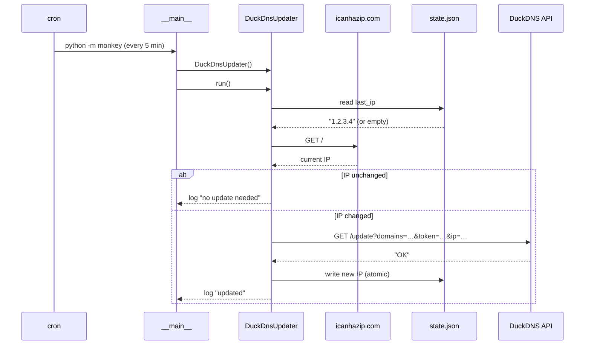

# DDNS Update Monkey


Keeps a [DuckDNS](https://www.duckdns.org) hostname pointed at your home IP address.
Runs every 5 minutes via cron and only calls the DuckDNS API when the public IP has actually changed.
Fetches the current IP from `ipv4.icanhazip.com`, compares it to the last known value persisted in `state.json`, and updates DuckDNS if they differ.

## Requirements

- Raspberry Pi (or any Linux host with cron)
- Python 3.13+
- A free [DuckDNS](https://www.duckdns.org) account with a subdomain set up

## Architecture

### Runtime sequence



## Configuration

Configuration is split across two files intentionally:

- **`.env`** — secrets (credentials). Never commit this file.
- **`config.toml`** — non-secret settings (IP service URL, timeouts, file paths).

### Credentials (`.env`)

Copy `.env.example` to `.env` and fill in your credentials:

```bash
cp .env.example .env
```

```dotenv
DUCKDNS_TOKEN=your-token-here
DUCKDNS_DOMAIN=your-subdomain
```

The token is at the top of the DuckDNS dashboard. The domain is just the subdomain part, without `.duckdns.org`.

### Settings (`config.toml`)

```toml
[ip]
service_url     = "https://ipv4.icanhazip.com"
request_timeout = 10

[duckdns]
update_url      = "https://www.duckdns.org/update"
request_timeout = 10

[files]
state = "state.json"
```

## Install & run

```bash
python3 -m venv .venv
.venv/bin/pip install .
.venv/bin/python -m monkey
```

## Development

```bash
python3 -m venv .venv
.venv/bin/pip install -e ".[dev]"
.venv/bin/pytest
```

## Deployment

See [etc/cron.d/README.md](etc/cron.d/README.md) for installation steps.

## Troubleshooting

| Symptom | Likely cause |
|---|---|
| `Missing required environment variable: DUCKDNS_TOKEN` | `.env` is missing or the variable name is wrong |
| `IP service returned HTTP 4xx/5xx` | `ipv4.icanhazip.com` is temporarily unavailable — will retry on next cron tick |
| `DuckDNS returned HTTP 4xx` | Token is invalid or expired — check the DuckDNS dashboard |
| `DuckDNS returned unexpected response` | DuckDNS API returned something other than `OK` — check the domain name |
| `state.json is corrupt` | State file was partially written — it is reset automatically |

## State file

`state.json` persists the IP from the previous run. On first run the file doesn't exist yet, so the IP is treated as unknown and DuckDNS is updated immediately. If the file is deleted, the same bootstrap happens on the next run.

## Security

- `.env` is listed in `.gitignore` and must never be committed — it contains your DuckDNS token
- The token grants full control over your DuckDNS domains; treat it like a password

## Contributing

Found a bug or have an idea? Open an issue or send a PR.
Run `pytest` before submitting and keep changes focused.

## License

MIT © Jan Rothen — see [LICENSE](LICENSE) for details.
